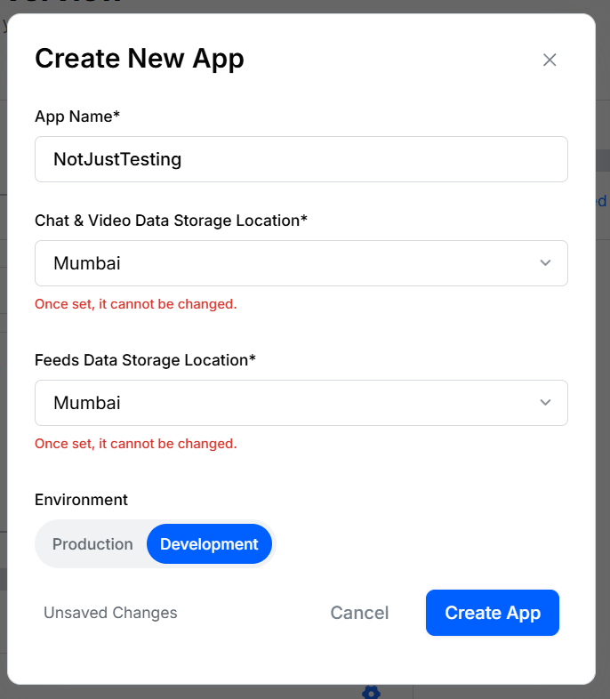

### Setup

First, Install the following packages

```bash
npx expo install @clerk/clerk-expo @clerk/types @clerk/expo-passkey expo-secure-store expo-auth-session expo-web-browser expo-build-properties
```

### Stream Setup

Go to create new app 


 
For documentation of React native go here :-

http://getstream.io/chat/docs/sdk/react-native/

Add this dependancy for chatting

```bash
npx expo install stream-chat-expo stream-chat-react-native
npx expo install @react-native-community/netinfo expo-image-manipulator react-native-gesture-handler react-native-reanimated react-native-svg
```

Import react native gesture handler root view and wrap the root _layout with it

```tsx
import {GestureHandlerRootView} from "react-native-gesture-handler"

function RootLayout(){
   return(
      <GestureHandlerRootView>
         {children}
      </GestureHandlerRootView>
   )
}
```

Now , create channel in root layout of protected layout and for testing use this code

```tsx
import { Stack } from "expo-router"
import { useEffect } from "react";
import { StreamChat } from "stream-chat";
 
// this is not secret key
const client = StreamChat.getInstance("sxhhvdzn5xx4");


const Layout = () => {

    useEffect(() => {
  const connect = async () => {
    try {
      await client.connectUser(
        { id: "jlahey", name: "Jim Lahey", image: "https://i.imgur.com/fR9Jz14.png" },
        client.devToken("jlahey")
      );
      const channel = client.channel("messaging", "the_park", { name: "The Park" });
      await channel.watch();
    } catch (err) {
      console.error("StreamChat connection error:", err);
    }
  };
  connect();
}, []); // <– Empty array means “run once on mount” :contentReference[oaicite:3]{index=3}

  return (
    <Stack>
        <Stack.Screen name="(tabs)" options={{headerShown:false}}/>
    </Stack>
  )
}

export default Layout
```