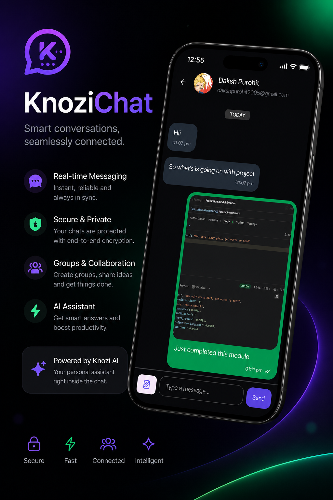
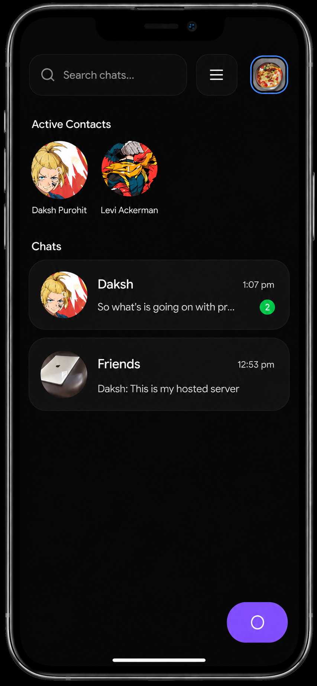
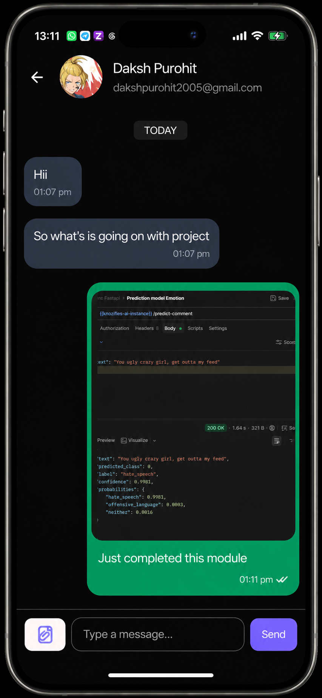
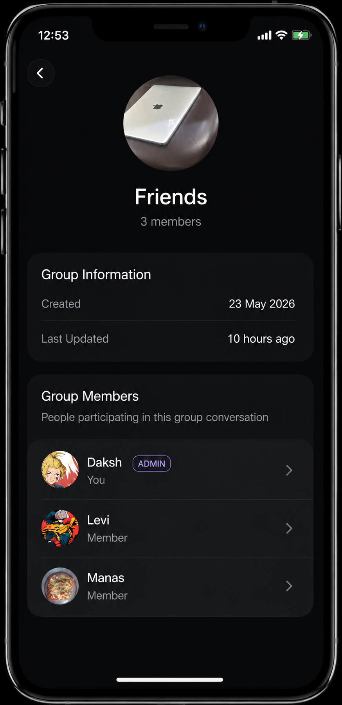
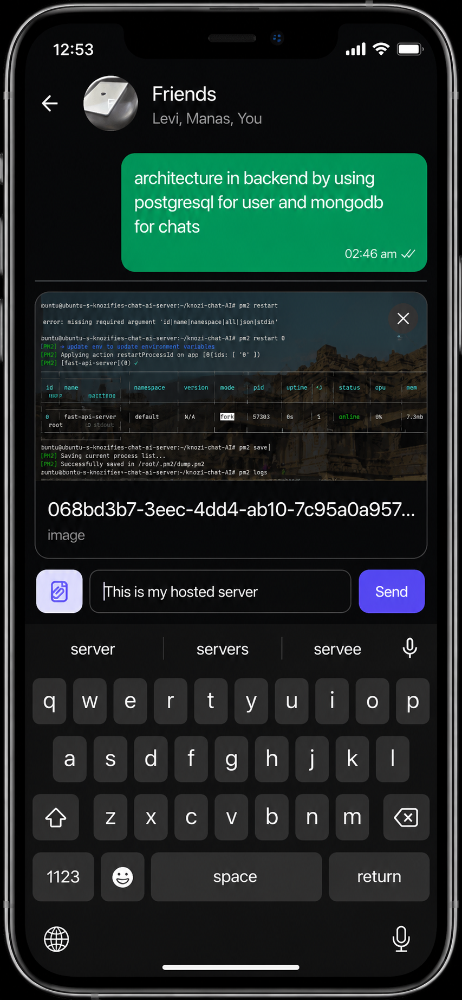
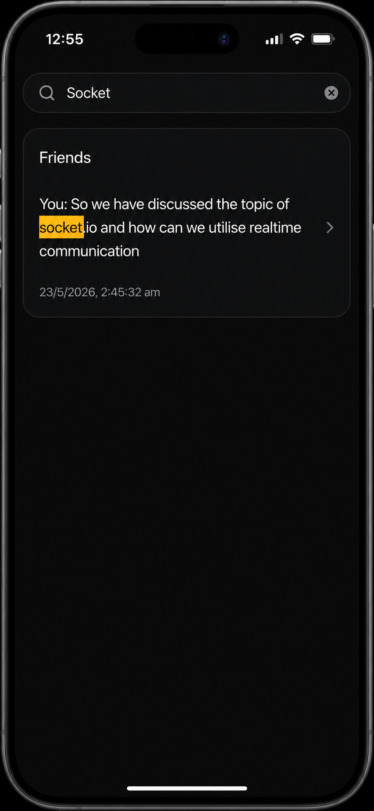
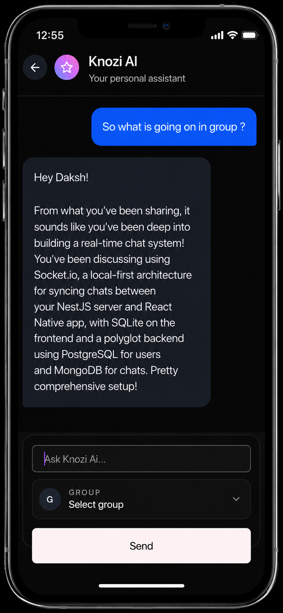

# KnoziChat

> A modern real-time messaging platform powered by React Native, NestJS, Socket.IO, Redis, and AI-enabled conversations.



## APK Download

### Android APK

https://expo.dev/artifacts/eas/jD1GYnAXZ8PgSLRyHE3TST.apk

KnoziChat is an offline-first Android chat application designed around scalable real-time communication, intelligent group interactions, AI-assisted conversations, and distributed backend architecture.

The platform combines:

- Real-time one-to-one and group messaging
- AI-powered contextual conversations
- Local-first synchronization
- Redis-backed conversational state management
- Scalable event-driven backend systems

## Backend and API

This app is built with a NestJS backend and a FastAPI AI service.

For backend implementation details, visit:

- Backend Repository: https://github.com/EzioAuditore12/KnoziChat-Backend

Hosted API docs:

- NestJS API Docs: https://knozichat.online/api
- FastAPI Service Docs: https://knozify.space/docs

---

# TODO / Roadmap

- [ ] Publish application to Google Play Store
- [ ] Push notification support
- [ ] Offline storage and synchronization for media files
- [ ] Voice and video calling support
- [ ] End-to-end encrypted conversations
- [ ] Message reactions and threaded replies
- [ ] AI memory persistence across conversations

---

# Preview

| Home Screen                        | Personal Chat                    |
| ---------------------------------- | -------------------------------- |
|  |  |

| Group Information                        | Group Messaging                        |
| ---------------------------------------- | -------------------------------------- |
|  |  |

| Search                           |
| -------------------------------- |
|  |

| Knozi AI                         |
| -------------------------------- |
|  |

---

# Features

- Real-time one-to-one and group messaging
- AI-enabled contextual group conversations
- Offline-first chat synchronization using SQLite
- Local full-text search using SQLite FTS5
- Media and image sharing
- JWT-based authentication and authorization
- Redis-backed conversational session management
- Context-aware AI assistant integrated into conversations
- Hybrid polyglot persistence architecture
- Modern mobile-first UI built using React Native + Expo

---

# Architecture Overview

KnoziChat follows a distributed event-driven backend architecture optimized for low-latency communication and offline-first synchronization.

## Core Components

### Frontend

- React Native
- Expo
- TypeScript
- Zustand
- React Query
- NativeWind
- SQLite

### Backend

- NestJS
- Fastify
- Node.js
- Socket.IO
- FastAPI
- LangChain

### Databases & Infrastructure

- PostgreSQL
- MongoDB
- Redis
- SQLite
- Docker

---

# Repositories

## Frontend Repository

https://github.com/EzioAuditore12/KnoziChat

## Backend Repository

https://github.com/EzioAuditore12/KnoziChat-Backend

---

# AI-Powered Conversations

KnoziChat integrates FastAPI and LangChain to enable contextual AI interactions directly inside conversations and group chats.

The AI layer is capable of:

- Maintaining conversational awareness
- Understanding ongoing group context
- Generating intelligent contextual replies
- Supporting interactive AI-assisted communication

---

# Offline-First Architecture

The application uses SQLite locally on-device to:

- Persist conversations offline
- Maintain cached message history
- Enable instant UI rendering
- Synchronize chats once connectivity is restored

---

# Tech Stack

| Layer          | Technologies                   |
| -------------- | ------------------------------ |
| Frontend       | React Native, Expo, TypeScript |
| Backend        | NestJS, Fastify, Node.js       |
| Realtime       | Socket.IO                      |
| AI Layer       | FastAPI, LangChain             |
| Databases      | PostgreSQL, MongoDB, SQLite    |
| Infrastructure | Redis, Docker                  |

---

# Getting Started

## Clone Frontend Repository

```bash
git clone https://github.com/EzioAuditore12/KnoziChat
cd KnoziChat
```

---

## Install Dependencies

```bash
pnpm install
```

---

## Start Expo Client

```bash
pnpm start
```

---

## Clone Backend Repository

```bash
git clone https://github.com/EzioAuditore12/KnoziChat-Backend
cd KnoziChat-Backend
```

---

## Start Backend

```bash
pnpm install
pnpm run start:dev
```

---

# Environment Variables

## Client

```env
EXPO_PUBLIC_API_URL=
EXPO_PUBLIC_SOCKET_URL=
EXPO_PUBLIC_AI_URL=
```

## Backend

```env
DATABASE_URL=
JWT_SECRET=
REDIS_URL=
MONGODB_URL=
```

---

# Why KnoziChat?

KnoziChat was built to explore:

- Real-time distributed systems
- Offline-first mobile architectures
- AI-assisted communication
- Scalable backend engineering
- Polyglot persistence strategies
- Modern mobile system design

---

# License

This project is intended for educational and portfolio purposes.
